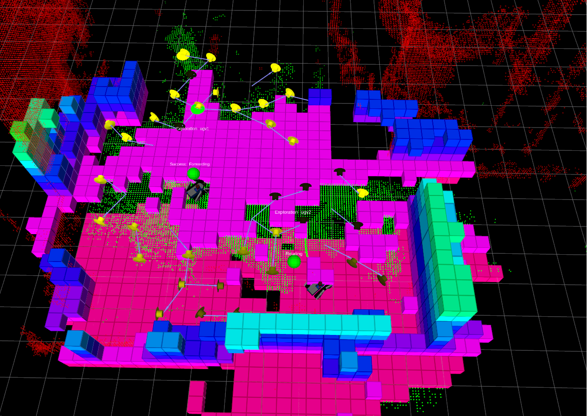
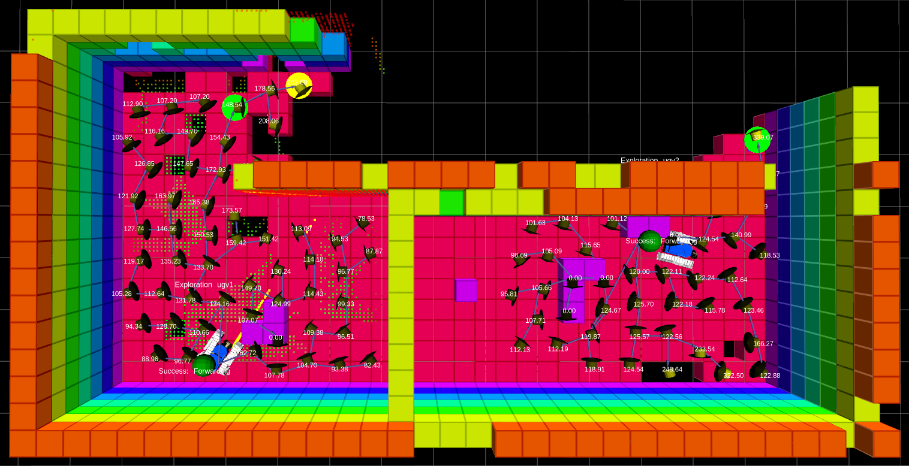

# 3D Multi-Robot Exploration 

<!-- TOC -->

- [3D Multi-Robot Exploration](#3d-multi-robot-exploration)
  - [Overview](#overview)
  - [Main Scripts](#main-scripts)
  - [How to run an exploration](#how-to-run-an-exploration)
    - [PyQt GUIs](#pyqt-guis)
    - [What is going to happen?](#what-is-going-to-happen)
  - [How to prioritize the exploration](#how-to-prioritize-the-exploration)
  - [How to build, save and load a volumetric map](#how-to-build-save-and-load-a-volumetric-map)
  - [Information gain configuration and issues](#information-gain-configuration-and-issues)
    - [V-REP sensor model](#v-rep-sensor-model)
    - [Experimental package `expl_pointcloud_filter`](#experimental-package-expl_pointcloud_filter)
  - [Robotic simulator modes](#robotic-simulator-modes)
    - [Gazebo modes](#gazebo-modes)
    - [V-REP modes](#v-rep-modes)
- [3D Exploration with drones](#3d-exploration-with-drones)
  - [Volumetric Exploration](#volumetric-exploration)
  - [Surface Exploration](#surface-exploration)
    - [Notes](#notes)

<!-- /TOC -->

Please read the main **[README.md](./README.md)** file and install the required tools using the [install.sh](./install.sh) script before reading this file.

 
 

## Overview

Below you can find instructions on how to launch multi-robot exploration under V-REP and gazebo. Use the [PyQt GUIs](#pyqt-guis) for quickly launch an exploration process.

---
## Main Scripts

We have **3 packages** that collect the launch files we need for starting a multi-robot exploration: 
- `ugv_3dexplorer` for the tracked UGVs under V-REP [[link](exploration_ws/src/ugv_3dexplorer/README.md)]
- `jackal_3dexplorer` for the jackal robots under gazebo [[link](exploration_ws/src/ugv_3dexplorer/README.md)]
- `pioneer_3dexplorer` for the pioneer robots under V-REP [[link](exploration_ws/src/ugv_3dexplorer/README.md)]
  
These packages have scripts with the same names and functions, and the same structure. In the folder `<package>/scripts`, you can find: 
- `sim_launcher_exploration` 
main script for launching an exploration simulation. 
- `sim_launcher_exploration_ugv`
for launching the nodes of a single robot (mainly mapping, path planner, trajectory control, and exploration agent); it is used inside `sim_launcher_exploration`.
- `kill_vrep_sim` or `kill_gazebo_sim`
for killing all the ROS nodes and the robotic simulator.

Each script launches ROS nodes within [screen](http://aperiodic.net/screen/quick_reference) sessions. [Here](./SCREEN.md) you can find a very concise guide on how to check the processes and connect to the spawned screen sessions. 

---
## How to run an exploration 

For simplicity, let's focus on the tracked UGVs and the package `ugv_3dexplorer` [[link](exploration_ws/src/ugv_3dexplorer/README.md)]. Same steps apply for the other packages `jackal_3dexplorer` [[link](exploration_ws/src/ugv_3dexplorer/README.md)] and `pioneer_3dexplorer` [[link](exploration_ws/src/ugv_3dexplorer/README.md)]. Below, you just need to replace the package name in the ros commands.

Open a new terminal, and enter in the root folder of our repo `3DMR` and run:   
`$ source source_all.bash`   
`$ rosrun ugv_3dexplorer sim_launcher_exploration`    

or   
`$ source source_all.bash`     
`$ roscd ugv_3dexplorer/scripts`     
`$ ./sim_launcher_exploration`   
 
 In order to kill all the launched nodes and V-REP, run:   
`$ rosrun ugv_3dexplorer kill_vrep_sim`   
or   
`$ ./kill_vrep_sim` (if you are in `ugv_3dexplorer/scripts`)    

At the beginning of the script `sim_launcher_exploration`, you can find some input variables for setting different things, e.g. you can change the V-REP *world* (see the variables `WORLD_NAME`).

In order to run clean tests or stop everything, run the command:
`$ rosrun ugv_3dexplorer kill_vrep_sim`
(or press the button `Kill all` on the Qt GUI below) at the end of each simulation. This is **very important** and does actually guarantee that a proper shutdown of all the launched ROS nodes and V-REP application was performed. 

### PyQt GUIs

You can also launch the exploration system by using our PyQt GUIs. Open a new terminal, and enter in the root folder of the repo `3dmr` and run:     
* `$ ./main.py` for TRADR UGVs equipped with rotating laser-scanners
* `$ ./main_pioneer.py` for pioneer robots equipped with RGBD cameras
* `$ ./main_jackal.py` for jackal UGVs equipped with LIDARs, IMUs and cameras

If you launched `$ ./main.py`, once the GUI shows up:     
1) Press the button `Launch exploration` (this launches the script `sim_launcher_exploration` behind the curtains). Alternatively, press the button `Select world exploration` and select one of the available world from `ugv_3dexplorer/maps` then the exploration will start.   
2) Once you are happy, you can kill all the nodes and V-REP/gazebo by using the button `Kill` (this launches the script `kill_vrep_sim` or `kill_gazebo_sim`).   

The tooltips will give you some hints on how to use the different options. Please, read below for further information.  

A similar procedure can be applied if you launched `main_pioneer.py`  or `main_jackal.py`.

### What is going to happen?

* V-REP/gazebo is automatically launched on the selected (or default) world. The simulator main window does not show up when V-REP/gazebo is launched in *headless* mode. 

* RVIZ starts and shows the robots and their point cloud maps (this process may take a while). See the shell messages in the meanwhile. 
  
* A dense volumetric map $M$ is built by each robot to support traversability analysis. This map is segmented into traversable regions (green, `/ugvi/traversability`) and obstacle regions (red, `/ugvi/wall`).
  
* A low-resolution volumetric map $H$ is built by each robot to support fast information gain computation during the exploration. On RVIZ, you can visualize it by enabling the topic `/ugvi/expl_planner_ugvi/octomap_occupied`.

* The robots will start exploring the environment. The environment is represented at the topological level by an exploration tree $K$: nodes represent reachable and safe regions; edges represent traversable paths joining them. 

* During the operations, each robot marker (a colored sphere flying above the corresponding robot) will inform you about its status, e.g.
    * *Forwarding*: exploration planning success toward the Next node,
    * *Backtracking*: exploration planning success toward Parent node,   
    * *Completed*: exploration completed,  
    * *No Information*: no new information gain available, 
    * *PP Failure*: Path Planning failure toward the next node,
    * *Conflict (R: i)*: I have a conflict with `ugvi` on my goal,

* You can alternatively select a different default exploration world by modifying the input variable `WORLD_NAME` in the script `sim_launcher_exploration` (**please read also the following sections**).

 

In the above figure, each robot expands a search tree to plan the next best view configuration (yellow disk). In fact, each robot moves toward a closer configuration (green disk) along the selected best branch, up to a pre-fixed maximum distance.  

## How to prioritize the exploration 

You can add a new waypoint on the green (traversable) point cloud, and then use it to prioritize the exploration.  

1) In order to add a new waypoint, please, take a look at [README.navigation.md](./README.navigation.md#rviz-interface) file. For instance, for `Ugv1`, press the button `Waypoints Tool Sim Ugv1` (on the RVIZ toolbar) or press the key *'M'*. Then, add a new waypoint on the traversability cloud (the *green* point cloud) by clicking on a point. A marker will immediately appear on the cloud.

2) Once you have added a new waypoint, you can left-click on it and select the action `Exploration -> Append priority point` from the menu.

Please, take a look a this [video](https://youtu.be/D7CgLTFj48w) which shows a very simple example.

## How to build, save and load a volumetric map

This is explained [here](./README.navigation.md#how-to-build-save-and-load-a-volumetric-map).   

---
## Information gain configuration and issues 

In order to compute the information gains of the next candidate viewpoints in a meaningful way, we need to carefully consider how the *exploration octomap* $H$ is built (see the [paper](https://arxiv.org/pdf/2307.02417.pdf)). Note that $H$ is distinct from the *navigation octomap* $M$ that is used by the path planner for traversability analysis. 

Typically, a 3D rangefinder scan only includes sensor readings corresponding to rays that hit obstacles within the sensor perception range. These "obstacle" sensor rays are then integrated into the octomap through raycasting. Hence, maximum range readings are commonly discarded. 

Assume the robot moves in an outdoor scenario that consists of a flat ground terrain only populated by shallow obstacles up to a max certain height $h$: in such case, all surrounding voxels immediately above a height $h$ will perpetually remain in an *unknown* state (since never hit by any reported obstacle sensor ray). This entails that we'll always find informative candidate viewpoints around the robot, since the information gain of a candidate viewpoint $q$ typically "measures" how many *unknown* voxels fall within the sensor FOV at $q$ (see the [paper](https://arxiv.org/pdf/2307.02417.pdf)).

Therefore, without appropriately updating *all* the *free* voxels which fall within the sensor perception FOV, the robot may find itself surrounded by candidate viewpoints that are perpetually informative. In such a case, an exploration process that is driven by information gain maximization will drive the robot through a meaningless never-ending random walk.  

A solution to such a problem is to process the robot rangefinder perception (within the sensor driver or downstream) to include and appropriately represent the maximum range readings too: see the following two subsections: *[V-REP sensor model](#v-rep-sensor-model)* and [Experimental package `expl_pointcloud_filter`](#experimental-package-expl_pointcloud_filter).  

A more practical approach, which is a viable approximation in the case we know the maximum height $h$ of the obstacles (and the obstacles are not too far apart from each other), is to reduce the vertical sensor FOV is used to compute the information gain. This vertical sensor FOV `system/camera/verticalFov` can be set in the yaml configuration file of the 3 exploration packages mentioned [above](#main-scripts): for instance, see the jackal configuration file [exploration.yaml](jackal_ws/src/jackal_3dexplorer/launch/exploration.yaml).

### V-REP sensor model 

In some of the V-REP exploration worlds (namely, in the folder *ugv_3dexplorer/maps*), we use a different laser sensor model w.r.t. the patrolling and navigation worlds.  In these cases, the ouput 3D scans also include **maximum range readings** (not only the detected obstacle readings). We achieved that by:    
  1) modifying the V-REP laser sensor model: check this [file](./exploration_ws/src/ugv_3dexplorer/maps/laserd_sensor_model.md).
  2) increasing the maximum scan range to *30 m* in the laser parameter box. 

Note that the *30 m* range is bigger than the maximum sensor range which is currently used by the navigation octomap, i.e. *15 m*. This avoids confusing the maximum range readings as obstacle readings.

### Experimental package `expl_pointcloud_filter`

The experimental package `expl_pointcloud_filter` allows processing an input 3D scan, downsampling it and generating a lower-resolution output 3D scan that includes information about maximum range readings. The output scan should be carefully managed to avoid any confusion of the maximum readings as "obstacle" readings.  Please refer to its [README.md](exploration_ws/src/expl_pointcloud_filter/README.md) for more information.

---
## Robotic simulator modes

Refer to the following sections depending on which robotic simulator you are using.

### Gazebo modes

Gazebo can be launched in different modes. To this aim, you can use the input variable `LAUNCH_GAZEBO_MODE_ENV` inside the script `sim_launcher_exploration`. These are the allowed modes: 
* *0*: normal mode (you have to press the button play to start)
* *1*: headless mode (hidden) with automatic start (less computationally demanding)

If you use the Qt GUI, the option `V-REP mode` allows selecting the value of the variable `LAUNCH_GAZEBO_MODE_ENV`.

### V-REP modes

V-REP can be launched in different modes. To this aim, you can use the input variable `LAUNCH_VREP_MODE_ENV` inside the script `sim_launcher_exploration`. These are the allowed modes: 
* *0*: normal mode (you have to press the button play to start)
* *1*: headless mode (hidden) with automatic start (less computationally demanding)
* *2*: normal mode with automatic start

If you use the Qt GUI, the option `V-REP mode` allows selecting the value of the variable `LAUNCH_VREP_MODE_ENV`.

**WARNING**: with the pioneer robots equipped with RGBD cameras, **V-REP is not able to provide depth images when set in headless mode**. 

--- 
# 3D Exploration with drones

We successfully ported the `nbvplanner` package under ROS noetic, **Ubuntu 20.04**. In order to quickly launch a multi-robot exploration run:
`$ ./main_uav.py`
and then press the button `Launch Exploration`.

Packages used for UAVs simulation:
* `rotors_simulator`
* `mav_comm`  
  
## Volumetric Exploration 

Open a new terminal, and enter in the root folder of our repo `3DMR`:   
* source the 3DMR workspace
`$ source source_all.bash` 
* single-robot exploration    
`$ roslaunch interface_nbvp_rotors flat_exploration.launch `
* multi-robot exploration 
`roslaunch interface_nbvp_rotors multiagent_flat_exploration.launch`

Rviz (take a look here https://github.com/ethz-asl/nbvplanner/wiki/Visualization) is automatically launched. Alternatively, run: 
`$ roslaunch interface_nbvp_rotors rviz_flat_exploration.launch `

## Surface Exploration  

Run 
`$ roslaunch interface_nbvp_rotors area_exploration.launch `
or 
`$ roslaunch interface_nbvp_rotors multiagent_flat_exploration.launch `

### Notes

* original nbvplanner repository: https://github.com/ethz-asl/nbvplanner
* wiki: https://github.com/ethz-asl/nbvplanner/wiki
* demo: https://github.com/ethz-asl/nbvplanner/wiki/Demo-Scenario
