# 3DMR 

**3D Multi-Robot** Exploration, Patrolling and Navigation.

**Maintainer: [Luigi Freda](https://www.luigifreda.com)**

The 3DMR framework provides tools for 3D multi-robot *exploration*, *patrolling* and *navigation* tasks with different *robots* under different *simulators*. It provides the core *C++* implementation behind our papers:
* **[3D Multi-Robot Exploration with a Two-Level Coordination Strategy and Prioritization](https://arxiv.org/pdf/2307.02417.pdf)**   
 *L. Freda, T. Novo, D. Portugal, R.P. Rocha*    
 CoRR 2023

* **[3D Multi-Robot Patrolling with a Two-Level Coordination Strategy](http://www.luigifreda.com/pubs/Freda%20-%203D%20Multi-Robot%20Patrolling%20with%20a%20Two-Level%20Coordination%20Strategy%20-%20AURO%202018%20-%20pub.pdf)**   
*L. Freda, M. Gianni, F. Pirri, A. Gawel, R. Dubé, R. Siegwart, C. Cadena*   
Autonomous Robots, Springer, 2019.

This repository allows testing our proposed multi-robot strategies within [V-REP](http://www.coppeliarobotics.com/) and [gazebo](https://gazebosim.org/home). It extends and improves our previous framework **[3dpatrolling](https://github.com/luigifreda/3dpatrolling)**. [Here](./new_features.md), you can find a list of new features we added. 

 
 

  
## Main features

**Tasks**: 3D exploration, 3D patrolling, and  3D navigation. 

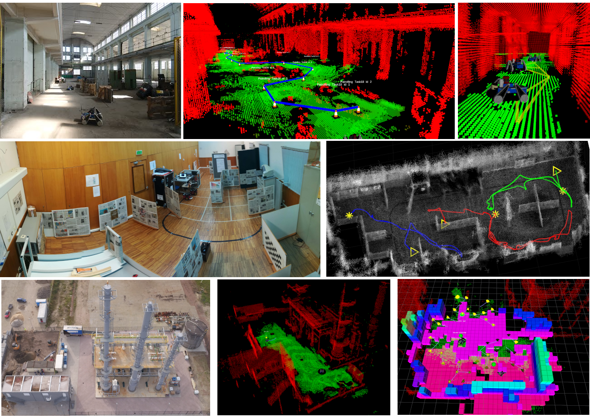 

**Robots**: tracked UGV, jackal UGV, pioneer 3-DX, and AscTec Firefly.

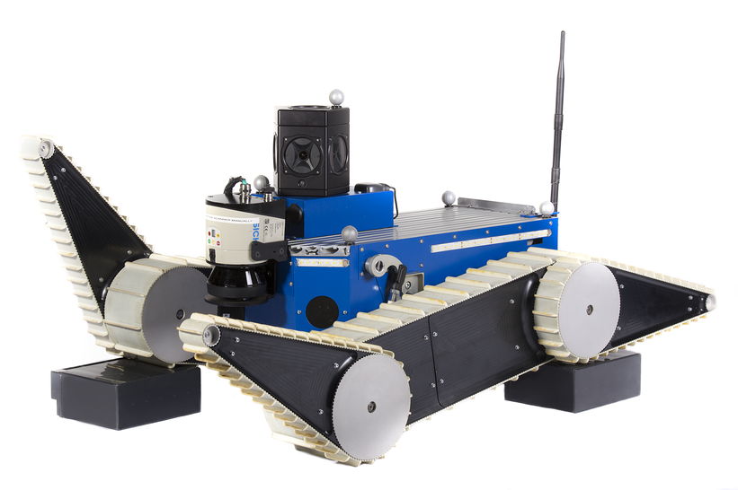 

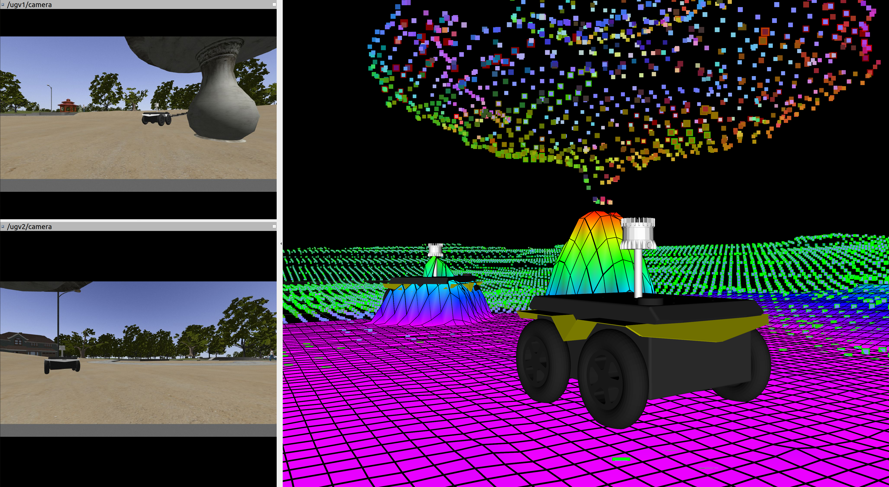
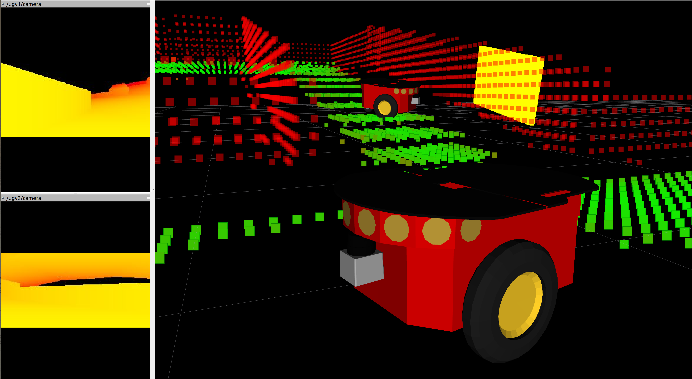

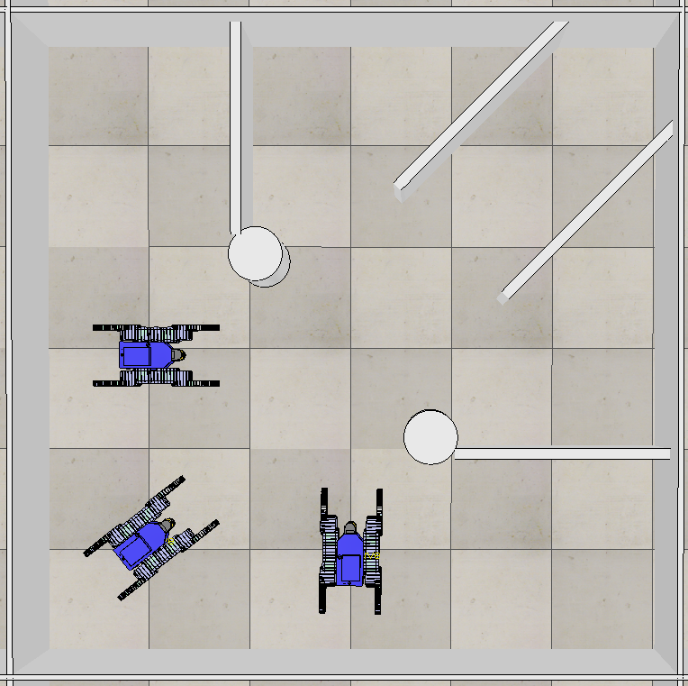
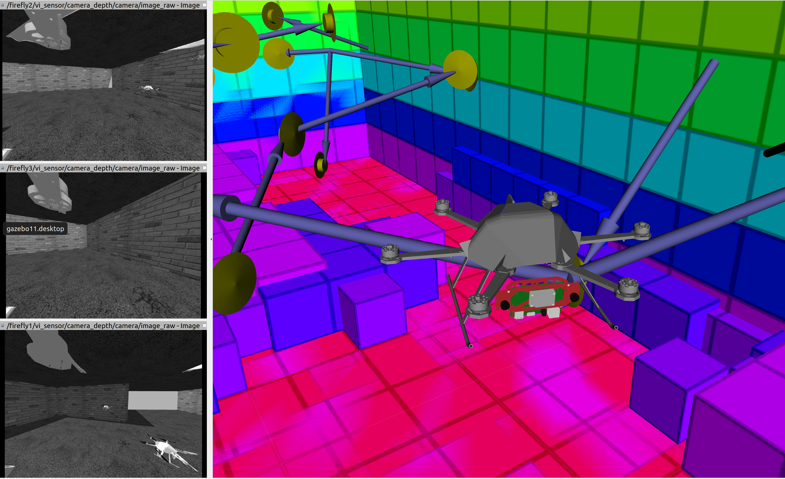

**Simulators**: [V-REP](http://www.coppeliarobotics.com/) and [gazebo](https://gazebosim.org/home).  

**GUIs**: our [PyQt GUIs](#guis) offer a convenient entry point for quickly launching exploration, patrolling and navigation systems

----
## Prerequisites

3DMR requires **ROS noetic** under Ubuntu **20.04**. Python3 is required in order to start our **PyQt** GUIs. 

## Quick install and build

Here, you can find a quick install procedure (tested under **Ubuntu 20.04**). Open a new terminal and get into the root folder of this repo. Run the following commands: 
* automagically install V-REP, gazebo, ROS dependencies and everything else is required, and build the workspaces:   
`$ ./install.sh`
* build all the workspaces in this repo: 
`$ ./build_all.sh`
* source all the 3DMR workspaces:   
`$ source source_all.bash`
Now, you're ready to test our *exploration*, *patrolling* and *navigation* systems. See the next sections for further details.  

Refer to [INSTALL.md](./INSTALL.md) if you need a manual installation. 

----
## Repo organization

### Workspaces

3DMR is a stack of ROS packages organized in different *workspace folders* (with suffix `_ws`): 
* `mapping_ws` collects volumetric mapping tools integrated in our system (octomap, [voxblox](https://github.com/ethz-asl/voxblox), robot-centric [elavation mapping](https://github.com/ANYbotics/elevation_mapping)).
* `nav_ws` collects the packages that allow path planning, trajectory control, navigation, and V-REP simulation with the tracked robots.
* `patrolling_ws` collects our main patrolling packages imported from [3dpatrolling](https://github.com/luigifreda/3dpatrolling).   
* `exploration_ws` collects packages used for multi-robot exploration and a port of the [nbvplanner](https://github.com/ethz-asl/nbvplanner) packages (exploration for drones) to ROS noetic.  
* `jackal_ws` collects gazebo packages and launch files for multi-robot navigation and exploration with a team of jackal robots equipped with LIDAR. 
* `pioneer_ws` collects packages used for multi-robot navigation and exploration with a team of pioneer robots equipped with RGBD cameras. 
* `teb_ws` collects the [TEB](https://github.com/rst-tu-dortmund/teb_local_planner) tools that we integrated into our system. 

In each workspace, you can use the script`compile_with_catkin_build.sh` to separately build the workspace with `catkin build`.  

###  Main scripts

Open a new terminal and from the root folder of this repo you can:
- build all the workspaces    
`$ ./build_all.sh `
- source the workspaces by using the command   
`$ source source_all.bash`
Once you have sourced the workspaces, you're ready to test the *patrolling* and *exploration* systems, or the *path planner* (see the next sections).
- if needed, clean the workspaces by running   
`$ ./clean_all.sh `

See the *[GUIs](#guis)* section below on how to use our `main_*.py` **GUI scripts**. 

----
## 3D Multi-robot exploration  

Refer to this [README.exploration.md](./README.exploration.md) for testing the exploration system.

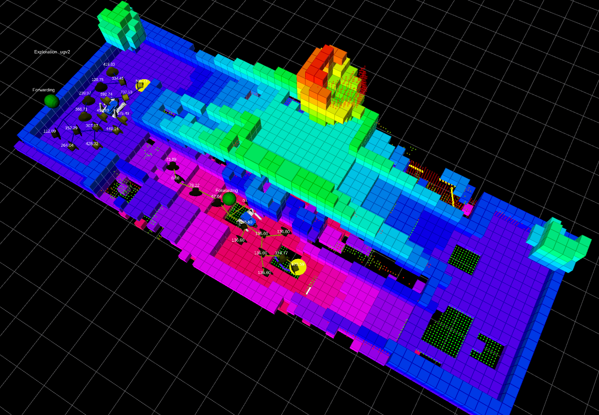
 

----
## 3D Multi-robot patrolling  

Refer to this [README.patrolling.md](./README.patrolling.md) for testing the patrolling system.

 
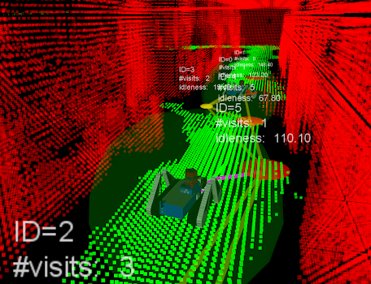 

----
## 3D Multi-robot path planner

* Refer to this [README.navigation.md](./README.navigation.md) for testing the navigation. 

----
## GUIs 

We have different **PyQt GUIs** for launching exploration, patrolling and path planner systems on the different robot systems. You can run: 

* `$ ./main.py` for TRADR UGVs equipped with rotating laser-scanners
* `$ ./main_pioneer.py` for pioneer robots equipped with RGBD cameras
* `$ ./main_jackal.py` for jackal UGVs equipped with LIDARs, IMUs and cameras
* `$ ./main_uav.py` for a team of UAVs equipped with stereo/depth cameras and IMUs ([nbvplanner](https://github.com/ethz-asl/nbvplanner))

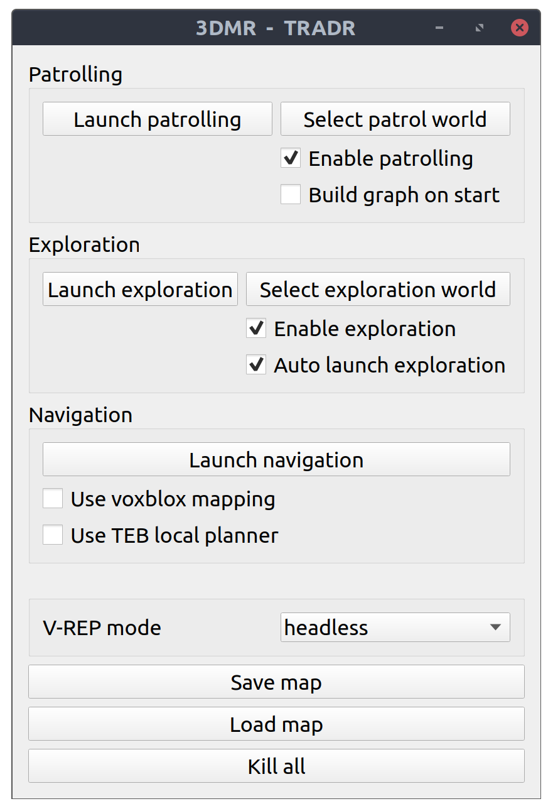
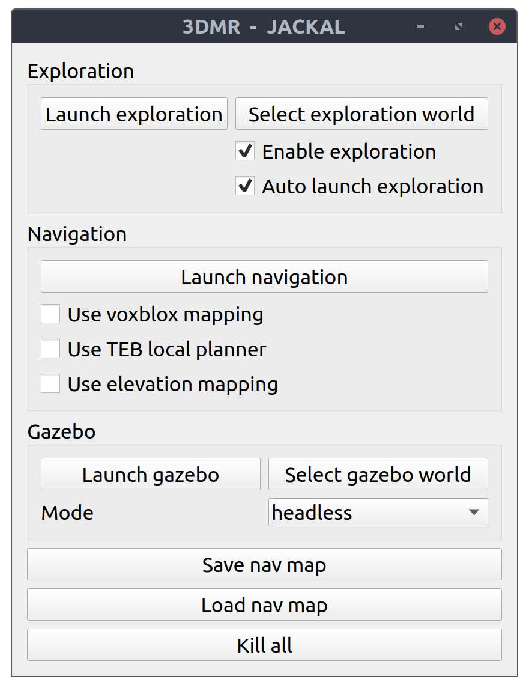
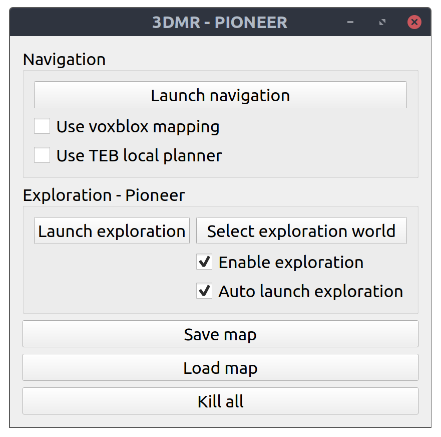
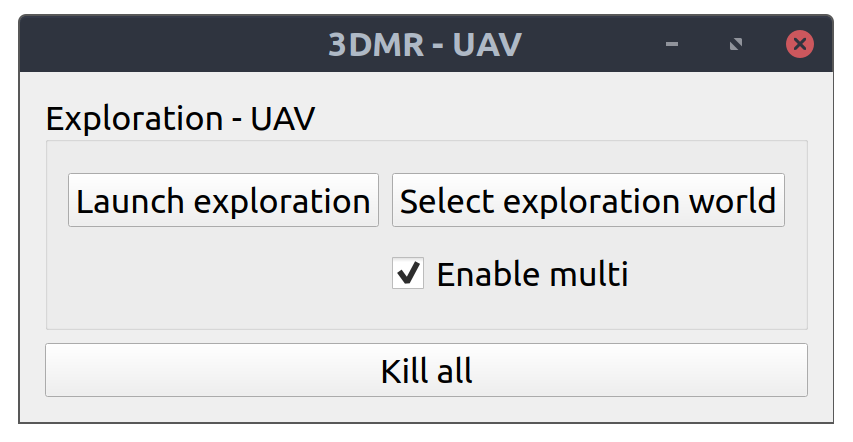

The buttons and tooltips should be self-explanatory. Start playing with them and refer to the following README files for further details:
- [README.exploration.md](./README.exploration.md)
- [README.navigation.md](./README.navigation.md)
- [README.patrolling.md](./README.patrolling.md)

----
## SLAM integration

On the TRADR tracked robots, we initially used the LIDAR SLAM frameworks [laser-slam](https://github.com/ethz-asl/laser_slam) and [segmap](https://github.com/ethz-asl/segmap). On the pioneer 3-DX robots with RGBD cameras, we used [RTAB-Map](http://wiki.ros.org/rtabmap).

If you have robots with 3D LIDARs, you may want to take a look at this cool paper for alternative SLAM tools: *[Present and Future of SLAM in Extreme Underground Environments](https://arxiv.org/abs/2208.01787)*

----
## Project webpages 

### TRADR EU project

This work started during the TRADR EU project. You can find a presentation of the TRADR project on its [website](https://www.tradr-project.eu/). 

### 3D Patrolling project 

Videos and further information about our previous [3dpatrolling](https://github.com/luigifreda/3dpatrolling) framework can be found on our [**3D patrolling** project webpage](https://sites.google.com/a/dis.uniroma1.it/3d-cc-patrolling/).  

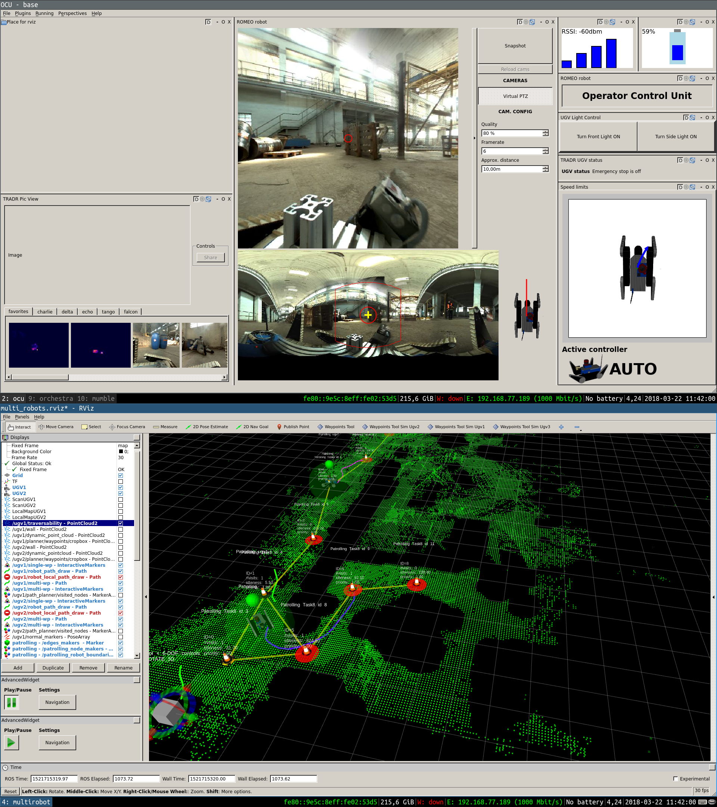
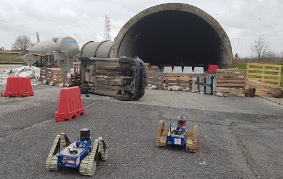 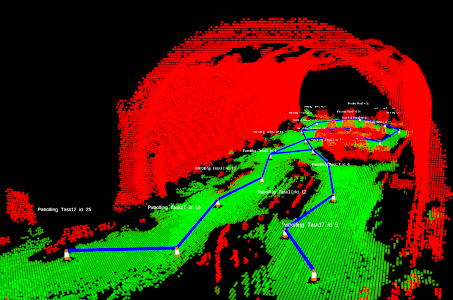

----
## License

The **3DMR** stack contains different ROS packages. Each package comes with its license. Where nothing is specified, a [GPLv3 license](./license/license-gpl.txt) applies to the software. 

Please cite our works (referred above) if you use our system in your projects.

----
## Contributing to 3DMR

You can contribute to the code base by using pull requests, reporting bugs, leaving comments, and proposing new features through issues. Feel free to get in touch: *luigifreda(at)gmail(dot)com*. Thank you!

----
## Credits 

* Some of the packages in the folders `nav_ws/src/robot` and `nav_ws/src/msgs`have been developed by the [TRADR team](https://www.luigifreda.com/wp-content/uploads/2018/04/IMG-20180321-WA0009-1024x768.jpg). Thanks to all the guys that shared with us cold tents, hot coffee and wonderful life moments during TRADR demos, integrations, exercises and reviews!

* We implemented our patrolling agent in the ROS package `patrolling3d_sim`. We used the package [patrolling_sim](http://wiki.ros.org/patrolling_sim) as a starting point (further details in our [3D patrolling paper](http://www.luigifreda.com/pubs/Freda%20-%203D%20Multi-Robot%20Patrolling%20with%20a%20Two-Level%20Coordination%20Strategy%20-%20AURO%202018%20-%20pub.pdf)). We would like to thank the Authors for their great work. 

* Our exploration agent is implemented in the ROS package `expl_planner`. The package [nbvplanner](https://github.com/ethz-asl/nbvplanner) was used as a starting point (further details in our [3D exploration paper](https://arxiv.org/pdf/2307.02417.pdf)). We sincerely express our gratitude to the Authors for their great work.

* The jackal workspace contains tools from https://github.com/jackal/jackal. Many thanks to the Authors of that repository.
