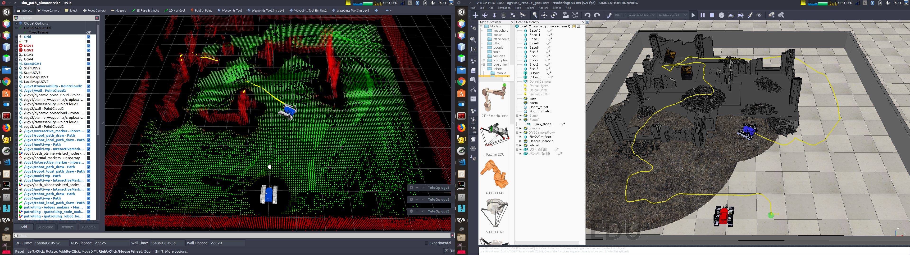
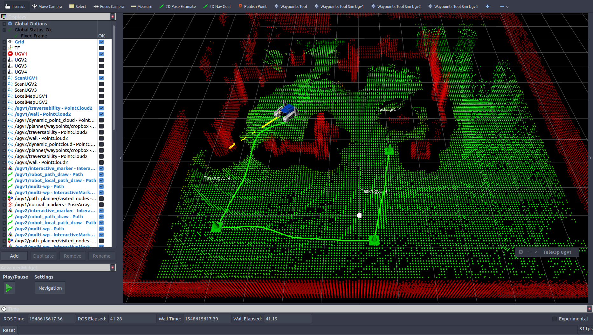

# 3D Multi-Robot Navigation 

<!-- TOC -->

- [3D Multi-Robot Navigation](#3d-multi-robot-navigation)
  - [Overview](#overview)
  - [Main Scripts](#main-scripts)
  - [How to run a path planning simulation](#how-to-run-a-path-planning-simulation)
    - [PyQt GUIs](#pyqt-guis)
    - [What is going to happen?](#what-is-going-to-happen)
  - [RVIZ Interface](#rviz-interface)
  - [Ros topics](#ros-topics)
  - [Reconfigure GUI](#reconfigure-gui)
  - [How to build, save and load a volumetric map](#how-to-build-save-and-load-a-volumetric-map)
  - [Robotic simulator modes](#robotic-simulator-modes)
    - [Gazebo modes](#gazebo-modes)
    - [V-REP modes](#v-rep-modes)

<!-- /TOC -->

Please read the main **[README.md](./README.md)** file and install the required tools using the [install.sh](./install.sh) script before reading this file.

<center>

</center>


## Overview

Below you can find instructions on how to launch navigation with simulated robots under V-REP and gazebo. Use the [PyQt GUIs](#pyqt-guis) for quickly launch an exploration process. 

--- 
## Main Scripts

We have **3 packages** that collect the launch files we need for starting a multi-robot navigation: 
- `path_planner` for the tracked UGVs under V-REP [[link](nav_ws/src/nav/path_planner/README.md)]
- `jackal_3dnav` for the jackal robots under gazebo [[link](jackal_ws/src/jackal_3dnav/README.md)]
- `pioneer_3dnav` for the pioneer robots under V-REP [[link](pioneer_ws/src/pioneer_nav/pioneer_3dnav/README.md)]
  
These packages have scripts with the same names and functions, and the same structure. In the folder `<package>/scripts`, you can find: 
- `sim_launcher_navigation` 
for launching a path planning simulation with all the required nodes (mapping, traversability analysis, trajectory control)
- `sim_launcher_ugv`
for launching the nodes of a single robot (mapping, path planner, trajectory control): this script is used by `sim_launcher_navigation`
- `save_map` 
for saving the robot map and trajectory (please, use `ugv1` for building and saving maps or trajectories)
- `kill_vrep_sim` or `kill_gazebo_sim`
for killing all the launched nodes and V-REP/gazebo.

Each script launches ROS nodes within [screen](http://aperiodic.net/screen/quick_reference) sessions. [Here](./SCREEN.md) you can find a very concise guide on how to check the processes and connect to the spawned screen sessions. 

<center>
<a href="https://youtu.be/qfytKc2FRs0" target="_blank" align="middle">
</a>
</center>

---
## How to run a path planning simulation

For simplicity, let's focus on the tracked UGVs and the package `path_planner` [[link](nav_ws/src/nav/path_planner/README.md)]. Same steps apply for the other packages `jackal_3dnav` [[link](jackal_ws/src/jackal_3dnav/README.md)] and `pioneer_3dnav` [[link](pioneer_ws/src/pioneer_nav/pioneer_3dnav/README.md)]. Below, you just need to replace the package name in the ros commands.

Open a new terminal, enter in the root folder of the repo, and run:   
`$ source source_all.bash`   
`$ rosrun path_planner sim_launcher_navigation`   

or you can also run:   
`$ source source_all.bash`   
`$ roscd path_planner/scripts`   
`$./sim_launcher_navigation`     


*N.B.*: in the script `sim_launcher_navigation`, you can find some input variables for setting different things, e.g. you can change the V-REP/gazebo *world* and the *number of robots* (see the variables `WORLD_NAME` and `NUM_ROBOTS`).

 In order to kill all the launched nodes and V-REP, run:   
`$ rosrun path_planner kill_vrep_sim`   
or
`$ ./kill_vrep_sim` (from `path_planner/scripts`)    
If the package relies on gazebo, you can fine there a script `kill_gazebo_sim`.

### PyQt GUIs

You can also launch the navigation system by using our PyQt GUI. Open a new terminal, enter in the root folder of the repo, and run:  
`$ ./main.py`  

Once the GUI shows up:  
1) press the button `Launch navigation` (this launches the script `sim_launcher_navigation` behind the curtains).    
2) once you are happy, you can kill all the nodes and V-REP by using the button `Kill` (this launches the script `kill_vrep_sim`).   

The tooltips will give you some hints on how to use the different options. Please. read below for further information.   


### What is going to happen?

* V-REP is automatically launched and a V-REP world is loaded. Please, note that the V-REP main window does not show up when V-REP is launched in *headless* mode.

* RVIZ starts, shows the robots and their point cloud maps (this process may take a while). For each robot, the currently built map is segmented into traversable regions (green, `/ugvi/traversability`) and obstacle regions (red, `/ugvi/wall`).

* A volumetric map is built by each robot as it moves in the environment.

* You can freely move robot `ugvi` around by using the `TeleOp ugvi` window. For instance, consider `ugv1` and click on the small window `TeleOp ugv1`: you can use keyboard arrows and `W`,`A`,`S`,`D` keys to move the robot around and play with the flippers. 

* You can also assign a set of waypoints to the robots as explained in next section, which provides a short description on how to use the RVIZ interface. 

---
## RVIZ Interface 

Once you have launched the script `sim_launcher_navigation` and RVIZ shows the maps, in order to control `ugv1`: 

1. Press the button `Waypoints Tool Sim Ugv1` (on the RVIZ toolbar) or press the key *'M'*. Then, add a new waypoint on the traversability cloud (the *green* point cloud) by clicking on a point. A marker will immediately appear on the cloud.
2. Press the key *'M'* (or the aforementioned button) and click on a green point everytime you need add a new waypoint.
3. You can move each created waypoint around by holding *left* click on it and moving the mouse. The waypoint should automatically stick to the traversability cloud (green) when you release the mouse button.
2. Once you are happy with waypoint selection, you can right click on one of the waypoints and select from the menu the action *"Append Task"*. If you want the robot to continuously revisit the waypoints (cyclic path), then select instead the action *"Append Cyclic Task"*. 
3. The color of each waypoint marker will change according to its status:
    - *Orange*, the waypoint has not been added as a task;
    - *Yellow*, the path planner is planning;
    - *Green*, a path has been successfully found;
    - *Red*, the path planner could not find a path.
4. Once the waypoints get green, in order to stop the trajectory control and the robot, you can right click on one of them and select the action *"Stop the controller"* from the menu.


In order to control `ugv2`, press the button `Waypoints Tool Sim Ugv2` (on the RVIZ toolbar) or press the key *'L'* and follow the same steps above. Similarly, for `ugv3`, press the button `Waypoints Tool Sim Ugv3` (on the RVIZ toolbar) or press the key *'K'*. If you need to control more robots at the same time by using the path planner, you can easily create new RVIZ waypoint tools by slightly updating the code in the package `path_planner_rviz_wp_plugin`.

Take a look at the following [video](https://youtu.be/qfytKc2FRs0): 
<center>
<a href="https://youtu.be/qfytKc2FRs0" target="_blank" align="middle">
</a>
</center>

--- 
## Ros topics 

During the simulation, the topics of robot `ugvi` are emitted by V-REP with the prefix `/vrep/ugvi`.

For each robot, the built volumetric map is segmented into traversable regions (green, `/ugvi/traversability`) and obstacle regions (red, `/ugvi/wall`).

---
## Reconfigure GUI 

You can check and modify some of the configuration parameters of the running nodes (for the navigation stack) by running:
`$ rosrun rqt_reconfigure rqt_reconfigure `


----
## How to build, save and load a volumetric map 

If you want to build and save a new volumetric map, first, you have to move the robot around and, then, save the built map. After this process, you can reload the saved map. In particular, you can perform this process by following these steps. 

First, run the script:   
```
$ rosrun path_planner sim_launcher_navigation
``` 
or launch the path planner system by using our PyQt GUI (as explained above). 

Then, move robot `ugvi` around by using the `TeleOp ugvi` window. For saving data, use `ugv1` and click on the small window `TeleOp ugv1`: you can use keyboard arrows and `W`,`A`,`S`,`D` keys to move the robot around and play with the flippers. 

To save the map and the robot trajectory, you can run the script `save_map`. This will save the map and the trajectories in the set destination folder (see the input variable `DEST_FOLDER=/tmp` in the same script `save_map`).

You can use the scripts `save_map` and `load_map` for saving and loading a map respectively. In particular, the following commands are used within the scripts to save and load a map:
* save the map (if you are using `ugv1`):   
`$ rosservice call /volumetric_mapping_ugv1/save_map "file_path: '/tmp/map.bt'"  `   
or (for a "shared" mapping system)
`$ rosservice call /volumetric_mapping/save_map "file_path: '/tmp/map.bt'"  ` 

* load a saved map (if you are using `ugv1`):  
`$ rosservice call /volumetric_mapping/load_map "file_path: '/tmp/map.bt'"  `  
or (for a "shared" mapping system)   
`$ rosservice call /volumetric_mapping_ugv1/load_map "file_path: '/tmp/map.bt'"  `  

**N.B.:** If you use the Qt GUI:   
* The button `Save map` allows saving the current maps (this launches the script `save_map`).   
* The button `Load map` allows loading a saved map (this launches the script `load_map`).

The maps will be saved in the binary format `.bt`. If you want to save the map in another format, you can use the [point_cloud_io](https://github.com/ANYbotics/point_cloud_io) ROS package that allows to read and save point cloud in `.ply` format. This ROS package is now integrated in the [mapping workspace](./mapping_ws/src/README.md). In particular, you can subscribe and save point clouds to a `ply` file with
```
$ rosrun point_cloud_io write _topic:=/vrep/ugv1/local_map _folder_path:=/home/user/my_point_clouds
```

Optionally, you can set parameters to fit the point cloud file names to your needs:

- `_file_prefix:=my_prefix` (default: "point_cloud")
- `_file_ending:=my_ending` (default: "ply", currently only format which is supported for writing)
- `_add_counter_to_path:=false` (default: `true`)
- `_add_frame_id_to_path:=true` (default: `false`)
- `_add_stamp_sec_to_path:=true` (default: `false`)
- `_add_stamp_nsec_to_path:=true` (default: `false`)


Alternatively, you can run (from [http://wiki.ros.org/pcl_ros](http://wiki.ros.org/pcl_ros))
```
 $ rosrun pcl_ros pointcloud_to_pcd input:=/vrep/ugv1/local_map
```
which subscribes to the `/vrep/ugv1/local_map` topic and save each `pointcloud2` message in the current directory in `pcd` format. File names look like `1285627014.833100319.pcd`, the exact names depending on the message time stamps. 


---
## Robotic simulator modes

Refer to the following sections depending on which robotic simulator you are using.

### Gazebo modes

Gazebo can be launched in different modes. To this aim, you can use the input variable `LAUNCH_GAZEBO_MODE_ENV` inside the script `sim_launcher_exploration`. These are the allowed modes: 
* *0*: normal mode (you have to press the button play to start)
* *1*: headless mode (hidden) with automatic start (less computationally demanding)

If you use the Qt GUI, the option `V-REP mode` allows selecting the value of the variable `LAUNCH_GAZEBO_MODE_ENV`.

### V-REP modes

V-REP can be launched in different modes. To this aim, you can use the input variable `LAUNCH_VREP_MODE_ENV` inside the script `sim_launcher_exploration`. These are the allowed modes: 
* *0*: normal mode (you have to press the button play to start)
* *1*: headless mode (hidden) with automatic start (less computationally demanding)
* *2*: normal mode with automatic start

If you use the Qt GUI, the option `V-REP mode` allows selecting the value of the variable `LAUNCH_VREP_MODE_ENV`.

**WARNING**: with the pioneer robots equipped with RGBD cameras, **V-REP is not able to provide depth images when set in headless mode**. 