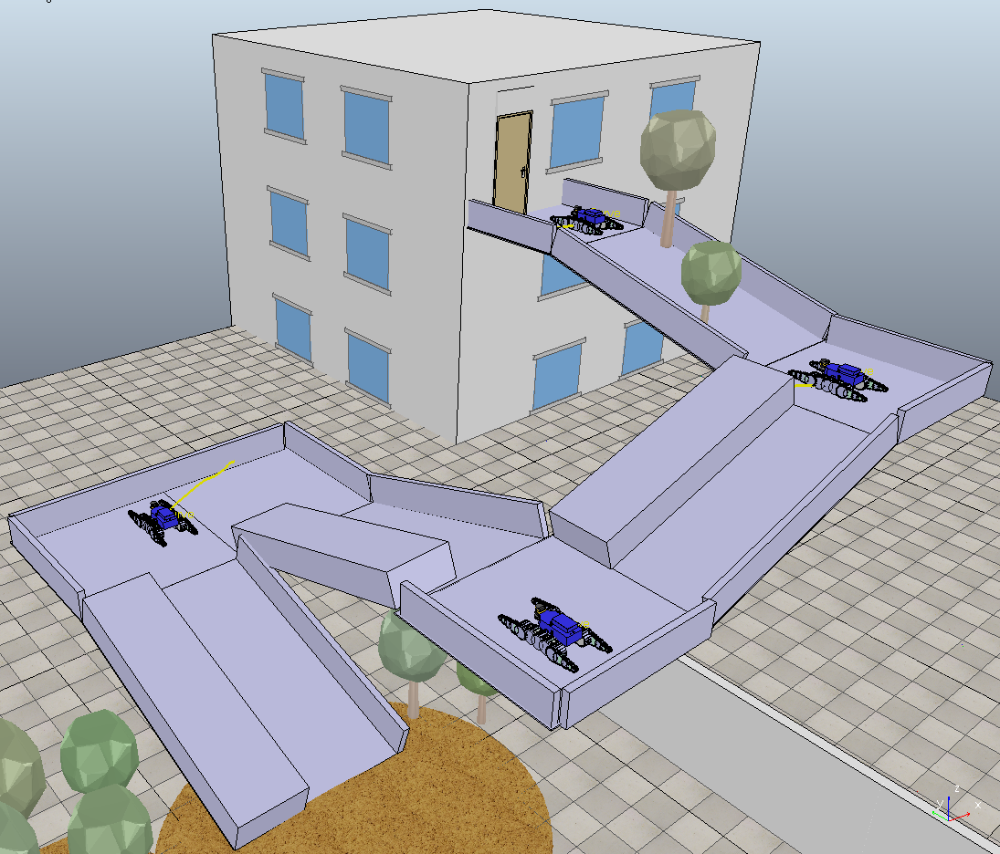
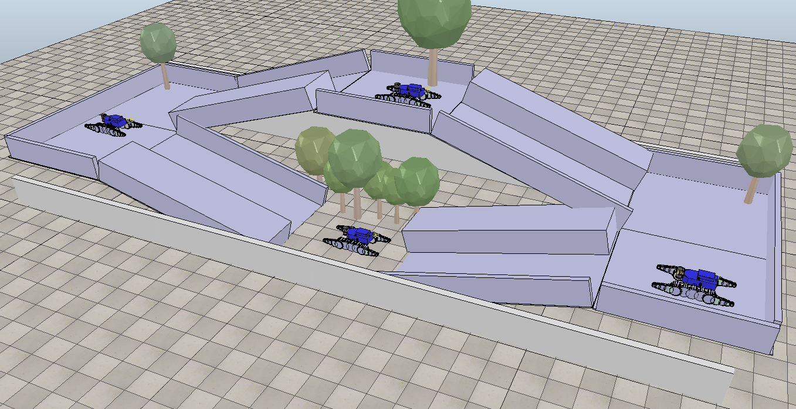
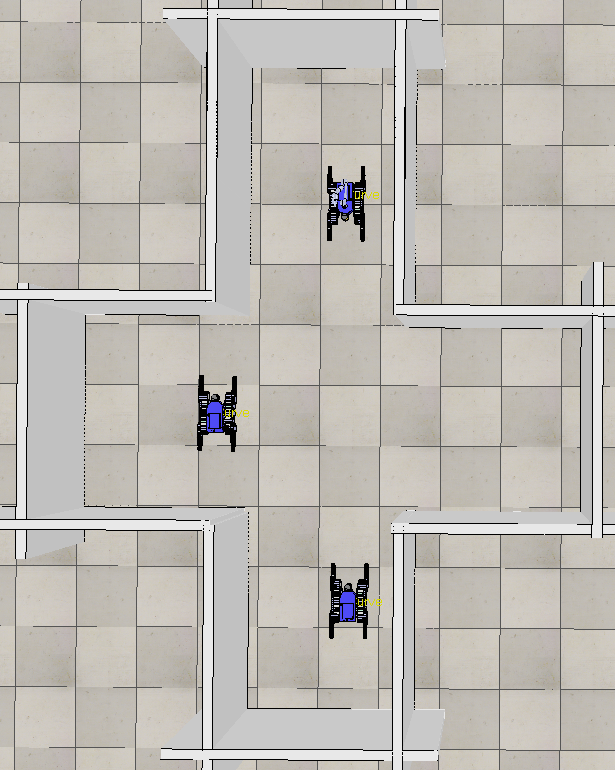
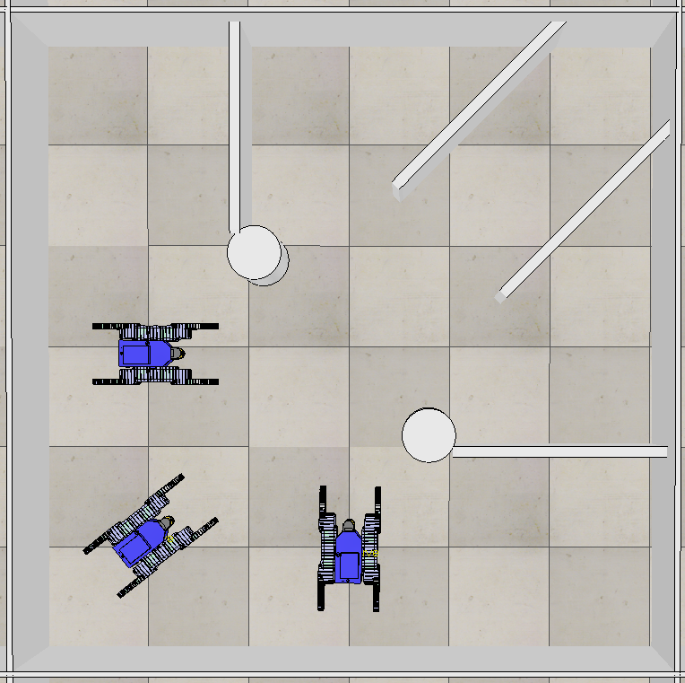
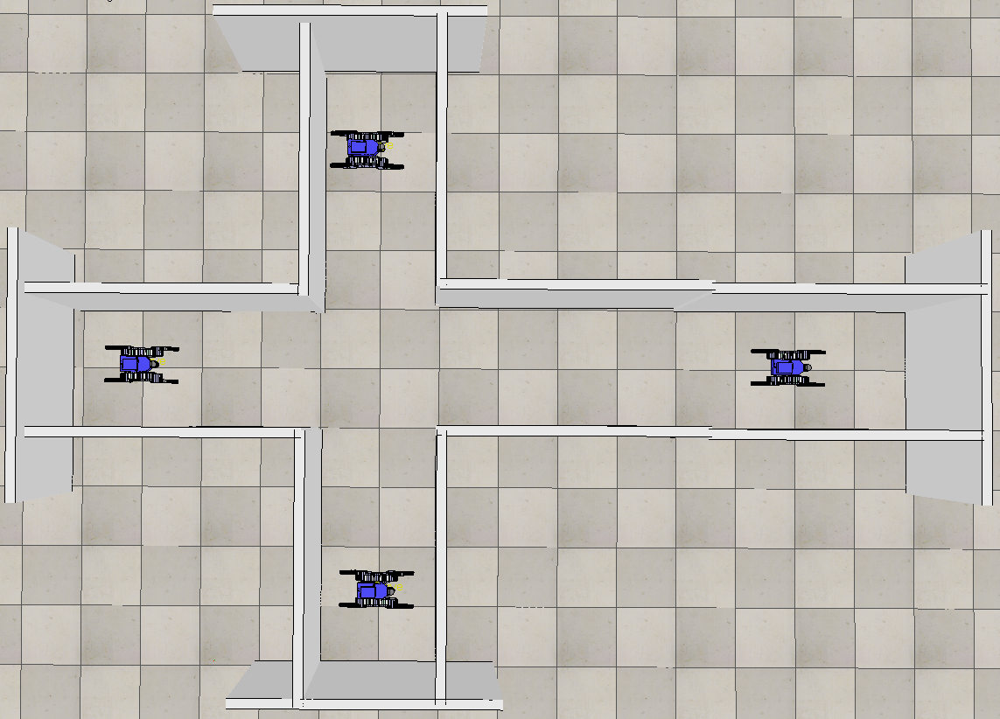
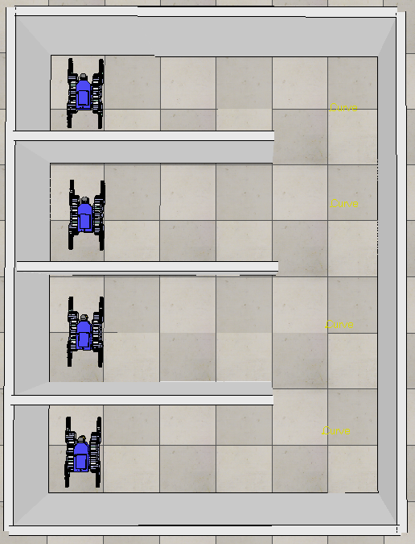
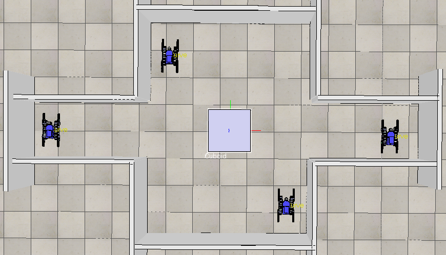
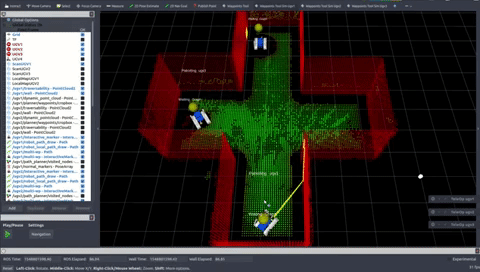

# 3D Multi-Robot Patrolling

<!-- TOC -->

- [3D Multi-Robot Patrolling](#3d-multi-robot-patrolling)
  - [Overview](#overview)
  - [Main Scripts](#main-scripts)
  - [How to run the patrolling strategy](#how-to-run-the-patrolling-strategy)
    - [PyQt GUI](#pyqt-gui)
    - [What is going to happen?](#what-is-going-to-happen)
    - [V-REP modes](#v-rep-modes)
  - [Patrolling scenarios](#patrolling-scenarios)
  - [How to build, save and load a volumetric map](#how-to-build-save-and-load-a-volumetric-map)
  - [How to create a new graph](#how-to-create-a-new-graph)
  - [How to create a new scenario](#how-to-create-a-new-scenario)
  - [Save a robot trajectory for the scenario](#save-a-robot-trajectory-for-the-scenario)
  - [Deploying on real robots](#deploying-on-real-robots)

<!-- /TOC -->

Please read the main **[README.md](./README.md)** file and install the required tools using the [install.sh](./install.sh) script before reading this file. Note that, at the present time, patrolling is supported only the tracked UGVs.

 

 

## Overview

Below you can find instructions on how to launch multi-robot patrolling under **V-REP**. 

--- 
## Main Scripts

Available in the folder `patrolling3d_sim/scripts`:
- `sim_launcher_patrolling` 
main script for launching a patrolling simulation 
- `sim_launcher_patrolling_ugv`
for launching the nodes of a single robot (mainly mapping, path planner, trajectory control, patrolling agent); it is used inside `sim_launcher_patrolling`
- `save_map` 
for saving the robot map and trajectory (please, use `ugv1` for building and saving maps or trajectories)
- `kill_vrep_sim` 
for killing all the patrolling and V-REP nodes.
- `save_map` 
for saving the map (see the input variables in the script).
- `load_map`
for loading a map (see the input variables in the script).

**NOTE**: each script launches ROS nodes within [screen](http://aperiodic.net/screen/quick_reference) sessions. [Here](../../../SCREEN.md) you can find a very concise guide on how to check the processes and connect to the spawned screen sessions. 

---
## How to run the patrolling strategy

Open a new terminal, and enter in the root folder of the repo `3dpatrolling` and run:   
`$ source source_all.bash`   
`$ rosrun patrolling3d_sim sim_launcher_patrolling`    

or   
`$ source source_all.bash`     
`$ roscd patrolling3d_sim/scripts`     
`$ ./sim_launcher_patrolling`   
 
 In order to kill all the launched nodes and V-REP, run:   
`$ rosrun path_planner kill_vrep_sim`   
or   
`$ ./kill_vrep_sim` (from `patrolling3d_sim/scripts`)    

*N.B.*: at the beginning of the script `sim_launcher_patrolling`, you can find some input variables for setting different things, e.g. you can change the V-REP *world* (see the variables `WORLD_NAME`).

### PyQt GUI

You can also launch the patrolling system by using our PyQt GUI (python3 required). Open a new terminal, and enter in the root folder of the repo `3dpatrolling` and run:     
`$ ./main.py`  

Once the GUI shows up:   
1) Select a `.ttt` scenario from one of the subfolders in `patrolling3d_sim/maps`.    
2) Press the button `Launch patrolling` (this launches the script `sim_launcher_patrolling` behind the curtains).    
3) Once you are happy, you can kill all the nodes and V-REP by using the button `Kill` (this launches the script `kill_vrep_sim`).   

The tooltips will give you some hints on how to use the different options. Please, read below for further information.  

### What is going to happen?

* V-REP is automatically launched and a patrolling V-REP world is loaded. Please, note that the V-REP main window does not show up when V-REP is launched in *headless* mode.

* RVIZ starts, shows the robots and their point cloud maps (this process may take a while). For each robot, the built map is segmented into traversable regions (green, `/ugvi/traversability`) and obstacle regions (red, `/ugvi/wall`).

* A volumetric map is loaded in each robot mapping system; for convenience, we built, saved and pushed this map in the repo for you; you could also build a map and save it by yourself (see the dedicated section below).

* A graph (which nodes to visit) is loaded and used by the patrolling agents; for convenience, we built, saved and pushed this graph in the repo for you; you could also build the graph from scratch and save it (see the dedicated section below).

* The robots will start patrolling the environment. The enviroment is represented at topological level by a graph: nodes represent reachable and safe regions; edges represent traversable paths joining them. Patrolling requires the robot to continuously visit all the nodes so as to minimize the time lag between two visits (*node idleness*).

* During the operations, each robot marker (a colored sphere flying above the corresponding robot) will inform you about its status, e.g.
    * *PP Success (N: x)*: Path Planning success toward Next node with ID *x*,
    * *PP Failure (N: x)*: Path Planning failure toward next node with ID *x*,
    * *Conflict (N: x)(R: i)*: I have a conflict with `ugvi` on the node with ID *x*,
    * *Goal Intercepted (N: x)*: my goal with ID *x* has been intercepted/visited by a teammate,
    * *Critical PP Failure*: critical path planning failure, 
    * *Critical Node Conflict*: critical node conflict.

* You can select the patrolled scenario by modifying the input variable `WORLD_NAME` in the script `sim_launcher_patrolling` (**please read also the following sections**).

You can find some nice simulation videos on the [project webpage](https://sites.google.com/a/dis.uniroma1.it/3d-cc-patrolling/). 

### V-REP modes

V-REP can be launched in different modes. To this aim, you can use the input variable `LAUNCH_VREP_MODE` inside the script `sim_launcher_patrolling`. These are the allowed modes: 
* *0*: normal mode (you have to press the button play to start)
* *1*: headless mode (hidden) with automatic start (less computationally demanding)
* *2*: normal mode with automatic start

If you use the Qt GUI, the option `V-REP mode` allows selecting the value of the variable `LAUNCH_VREP_MODE`.

---
## Patrolling scenarios  

The patrolling scenes are collected in the folder `patrolling3d_sim/maps`. In this folder, you can find a specific subfolder `my-awesome-scenario` for each possible scenario you may want to use. In particular, inside a new folder `my-awesome-scenario`, you have to place:
* a V-REP world `my-awesome-scenario.ttt`  (binary V-REP description of a world)
* a saved volumetric map `my-awesome-scenario.bt`
* a saved graph representation `my-awesome-scenario.graph`
* a saved history of robot trajectories `my-awesome-scenario.dot`

In the script `patrolling3d_sim/scripts/sim_launcher_patrolling` you can select which scenario to use by setting the var `WORLD_NAME`. In the available 3D environments, the saved trajectory is used by the traversability analysis node (of the path planner) in order to quickly estimate the "correct" up-orientation of the normals.

  

 

  

----
## How to build, save and load a volumetric map 

If you want to build and save a new volumetric map, first, you have to move the robot around and, then, save the built map. After this process, you can reload the saved map. In particular, you can perform this process by following these steps:  

1. Set the variable `ENABLE_PATROLLING=0` in the script `sim_launcher_patrolling` (this will disable the automatic launch of the patrolling agent nodes). 

2. Run the script:   
`$ rosrun patrolling3d_sim sim_launcher_patrolling`    
With patrolling disabled, you can freely move robot `ugvi` around by using the `TeleOp ugvi` window. For saving data, use `ugv1` and click on the small window `TeleOp ugv1`: you can use keyboard arrows and `W`,`A`,`S`,`D` keys to move the robot around and play with the flippers. 

3. To save the map and the robot trajectory, you can run the script `save_map`. This will save the map and the trajectories in the set destination folder (see the input variable `DEST_FOLDER=/tmp` in the same script `save_map`).

4. Once you have recorded the map and the trajectory, you have to organize their files as explained in the previous section *"Patrolling scenarios"*.

*N.B.:* please, note that the command lines for loading a map are already included in script `sim_launcher_patrolling`.    

You can use the scripts `save_map` and `load_map` for saving and loading a map respectively. In particular, the following commands are used within the scripts to save and load a map:
* save the map (if you are using `ugv1`):   
`$ rosservice call /volumetric_mapping_ugv1/save_map "file_path: '/tmp/map.bt'"  `   
or (for a "shared" mapping system)
`$ rosservice call /volumetric_mapping/save_map "file_path: '/tmp/map.bt'"  ` 

* load a saved map (if you are using `ugv1`):  
`$ rosservice call /volumetric_mapping/load_map "file_path: '/tmp/map.bt'"  `  
or (for a "shared" mapping system)   
`$ rosservice call /volumetric_mapping_ugv1/load_map "file_path: '/tmp/map.bt'"  `  

*N.B.:* If you use the Qt GUI:   
* The checkbox `Enable patrolling` allows selecting the value of the variable `ENABLE_PATROLLING`.   
* The button `Save map` allows saving the current maps (this launches the script `save_map`).   
* The button `Load map` allows loading a saved map (this launches the script `load_map`).

----
## How to create a new graph 

You can save a graph by following these steps: 
* Enter in the script `patrolling3d_sim/scripts/sim_launcher_patrolling` and set the variables:   
`ENABLE_PATROLLING=0`   
`BUILD_GRAPH_ON_START="true"   `   
* Then open a new terminal, source the tradr workspace and this workspace, and then run:   
`$ roscd patrolling3d_sim/scripts`   
`$ ./sim_launcher_patrolling`   

When RVIZ is ready in front of you: 
* add your waypoints on the RVIZ interface: for adding a new point (1) press the key 'M' and then (2) stick a new marker on the green point cloud.
* once you have finished adding waypoints, press the mouse left button on one of the waypoints and select the action `Patrolling - append task`
* you can also move/change the waypoints and then rebuild the graph by selecting again the action `Patrolling - append task`
* a new graph will be then created and saved in the selected world folder (inside `patrolling3d_sim/maps`)

Take a look at the following [video](https://youtu.be/59UC6Ohq37E): 

You could also **build your graph interactively** and then immeditely start the patrolling. This can be done in a very similar way by: 
* First, setting the following variables in the script `sim_launcher_patrolling`:   
`ENABLE_PATROLLING=1`   
`BUILD_GRAPH_ON_START="true"`   
* Then, you can set your desired `WORLD_NAME`
* Next, run the script `sim_launcher_patrolling` and repeat the procedure above once RVIZ is ready and the maps have been loaded.
* Once you are ready, select the action `Patrolling - send task` and the robots will start patrolling the assigned graph.

*N.B.*: The essential nodes (needed to build the graph) are automatically called in the script `sim_launcher_patrolling`. In particular, these can be manually launched with the following command:   
`$ roslaunch patrolling_build_graph build_graph.launch map:=<name of your environment>`   

*N.B.*: if you use the Qt GUI, the checkboxes `Enable patrolling` and `Build graph on start` allow selecting the values of the variable `ENABLE_PATROLLING` and `BUILD_GRAPH_ON_START` respectively.

----
## How to create a new scenario 

1) Open a new terminal and run the following commands 
`$ roscd patrolling3d_sim`  
`$ cd maps`   
`$ mkdir <your-awesome-scenario-name>`   
`$ cd <your-awesome-scenario-name>`   
2) create a scenario in V-REP and save it within the folder   `<your-awesome-scenario-name>` by using the same name `<your-awesome-scenario-name>.ttt` (to get an idea, you can take a look at the other map folders inside the folder `patrolling3d_sim/maps`);
3) create a map for the world as explained in the above section *"How to build, save and load a map"*;
4) create a graph representation as explained in the above section *"How to create a new graph"*.

Finally, in order to use the newly created world, set the variable `WORLD_NAME` and the used number of robot `NUM_ROBOTS` in the script `sim_launcher_patrolling`. Then, launch the script `sim_launcher_patrolling`.

----
## Save a robot trajectory for the scenario

The node robot_trajectory_saver (in the package `robot_trajectory_saver`) implements the following functionalities:

* ros service to save the robot trajectories into a file "/my_path/filename.dot" in the form of a (boost) graph  
`$ rosservice call /robot_trajectory_saver_node/save_robot_trajectories_only "file_path: '/tmp/trajectory.dot'" `

* ros service to get the graph of the robot trajectories in the form of a nav_msgs::Path   
`$ rosservice call /robot_trajectory_saver_node/get_robot_trajectories_nav_msgs "{}"`   

**N.B.**: the required trajectory loading is automatically called in the main script `sim_launcher_patrolling`. The trajectory saving can be called by using the script `save_map`.

*N.B.:* If you use the Qt GUI:   
* The button `Save map` allows saving the current maps and the trajectories of `ugv1` and `ugv2`.   
* The button `Load map` allows loading some saved map and trajectories (used by the traversability analysis).

----
## Deploying on real robots

If you want to deploy the `patrolling3d_sim` nodes on real **robots** (or on **different computers**), it is **required to synch the system clocks of the different computer boards**. To this aim, you can use [chrony](https://chrony.tuxfamily.org/manual.html), for instance. If you do not want to synch the clocks then you have to disable stamped messages in the header `message_types.h` (contained in the package `patrolling3d_sim`).
