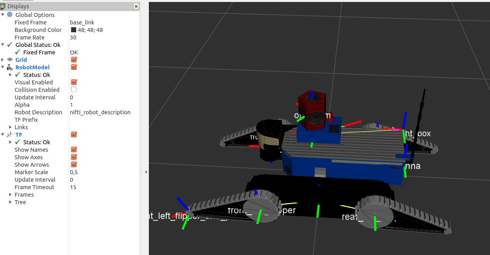
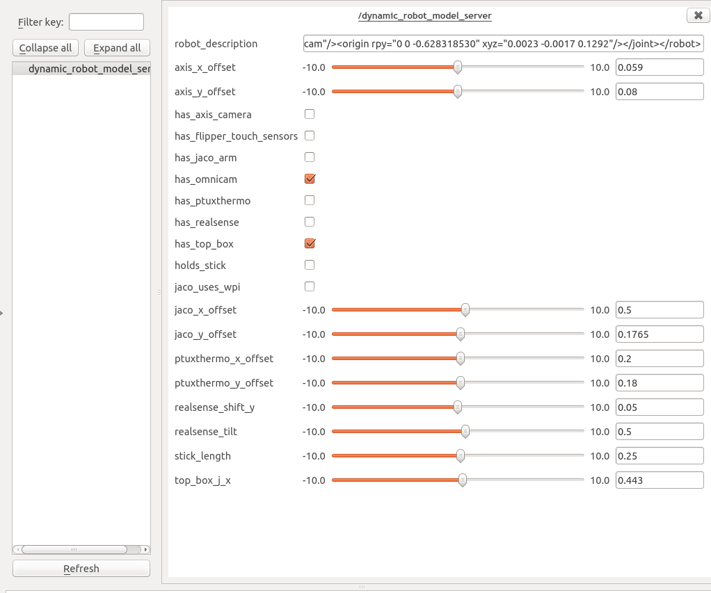

# nifti\_robot\_description

The package containing the NIFTI robot 3D model data which can be loaded in Rviz.

## Displaying the model in RViz

In an RViz view, add a `RobotModel` visualization, and change its `Robot Description` parameter to `nifti_robot_description`.

## Model (and robot) configuration

The model is configured by several files:

* `tradr-ugv-base/nifti_launchers/launch/default-robot.yaml`: The default configuration. This should be more or less
readonly.
* `tradr-ugv-base/nifti_launchers/launch/robot.yaml`: This file doesn't exist but default, but is **required**! So you
have to either make it a symlink to one of `(ctu|tno|dfki|roma|eth)-robot.yaml`, or create an empty file yourself.
Anything contained in this file overrides values from the default robot file.

Configuration from these YAML files applies both to the real robot and to the RViz visualization. If they're out of
sync, some parts of the system (namely laser filtering) work improperly. Then you need to do model calibration (see
below).

## Model calibration

To calibrate the config to correspond to the real configuration of the robot, there are several methods.

### Bool flags (`has_*`)

These are usually easy to figure out. Either the robot `has_arm`, or it has not :)

### Metric configs - "tape method"

Some of the configs specify the position of some payload on the robot. There is a helper point defined in TF which is
called `rear_right_box`, relative to which the payload should be positioned. You can find this point at the top rear
right corner of the robot body. You can then use a tape to measure the corresponding distance. `x` axis is forward, `y`
 axis is to the left. `z` points above the robot.

### Metric configs - the interactive method

Here we'll use `dynamic_reconfigure` to interactively play with the robot config.

If you're connected to live robot, just launch RViz. If you're on a standalone machine, call
`roslaunch nifti_robot_description display.launch simulate_robot.launch` .

From a different terminal, call `rosrun rqt_reconfigure rqt_reconfigure` . In the left part of the window, select
`dynamic_robot_model_server` . There should appear lots of controls on the right.

When you change the numeric values, you should immediately see a part of the robot body moving in RViz to
its new position.

The boolean flags have instant effect only on trasforms (which you should see appearing or disappearing). If you want to
 see e.g. a new payload on the robot body, you need to go to RViz, and disable and enable again the robot model. Then it
 should load the updated robot body with (or without) the payload you specified.

**Never edit the `robot_description` value directly.** It is updated automatically based on the config. You can copy
this string and safe it to a `*.urdf` file to get the robot model stored.

If you change a boolean flag and the robot model doesn't reload when you re-enable it, there was probably some problem
with generating the model, so check the console, if you don't see what kind of problem it is.

When you finish this interactive calibration, you need to manually store the changed values to `robot.yaml` - otherwise
the changes will get lost when the current roscore is shut down.

## Adding new payload to the robot model

The robot model is stored as a URDF file, which is understood by RViz and other tools. To allow flexibility in the URDF
file, we use a template language called XACRO which enables to customize the robot model dynamically.

The most essential file is `tradr-ugv-base/nifti_robot_description/urdf/nifti_robot.xacro` . It contains the definitions
of all components the robot can have. For simplicity, payload definition is conditionally included from the payload
packages.

Let's say you want to add payload named "4D camera". You should have a pacakge `4d_camera` which contains the URDF
description, meshes and textures for the camera.

To the `nifti_robot.xacro`, you first add a config named `has_4d_camera` (somewhere near the top):

    <xacro:arg name="has_4d_camera" default="0" />

Then, a little lower, you add a section including your URDF for the 4D camera:

    <xacro:if value="$(arg has_4d_camera)">
        <xacro:include filename="$(find 4d_camera)/urdf/4d_camera.xacro" />
        <joint name="rear_right_box_to_4d_camera" type="fixed">
            <parent link="rear_right_box" />
            <child link="4d_camera_base_link" />
            <origin xyz="0 0 0" rpy="0 0 -1.5708" />
    	</joint>
    </xacro:if>

This way, we've loaded the camera model and added a joint that attaches it to the `rear_right_box`. If you'd like to
add configurable x/y position of the camera, get inspired by the code of e.g. Axis camera you'll find in
`nifti_robot.xacro`.

When adding the new payload model, make sure it contains collision models of all links. If it only contains visual
models, then they're also used for collision checking, and if they're complicated structures, laser filtering becomes
expensive. The collision models can be either simple (ideally convex) meshes, or they can be composed of primitive
shapes (again, get inspired e.g. in `axis_camera_tradr`).

Meshes should be in Collada (DAE) format, and any links from the URDF to the meshes should be in the format

    package://4d_camera/meshes/main_mesh.dae

## Under the hood

### `print_robot_model.py`

The XACRO -> URDF conversion is done on the fly by script `nifti_robot_description/scripts/print_robot_model.py`.
This script loads the XACRO definition, robot configuration, and prints the corresponding URDF model. The basic use in
`nifti_robot_description/launch/load_robot_model.launch` directly saves this script's output to the
`nifti_robot_description` parameter, so no URDF file is generated on the disk.

If you want to see the URDF file (e.g. for debugging), you can call

    rosrun nifti_robot_description print_robot_model.py | less

and browse through the generated output. By default, this call loads the robot config from the running ROS parameter
server. If you'd rather like to use whatever is stored in the `robot.yaml`, call

    rosrun nifti_robot_description print_robot_model.py yaml | less

### Dynamic reconfigure

This package uses a hack to dynamic reconfigure to allow for dynamic list of parameters loaded from `robot.yaml`.
The trick is documented in `nodes/dynamic_robot_model_server.py`. It is not officially supported, so there may be some
surprises due to it.
